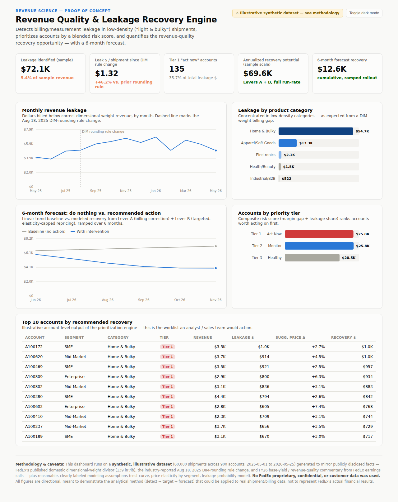

# Revenue Quality & Leakage Recovery Engine

**A revenue science proof-of-concept: detecting billing/measurement leakage in low-density (“light & bulky”) parcel shipments, prioritizing which accounts to act on, and forecasting the recovery.**

Prepared by [Kritika](mailto:mahnakritika3@gmail.com)

---

## The problem

Parcel carriers bill on the greater of a package's actual weight or its *dimensional weight* — a measure of how much space it takes up. Rate cards and negotiated contract terms, however, are set once and rarely revisited, while the underlying package mix keeps shifting toward lighter, bulkier e-commerce goods (apparel, home goods). The result: a structural, growing gap between what carriers *should* bill and what they actually collect, concentrated in exactly the categories e-commerce has grown fastest.

This project treats that gap as a data problem: **can it be detected, prioritized, and forecast from shipment-level data alone?**

## The approach

A three-stage pipeline, run end to end on a synthetic-but-realistic dataset:

| Stage | What it does |
|---|---|
| **Detect** | Recomputes correct dimensional-weight revenue per shipment from length/width/height and compares it to what was actually billed, sizing the leakage shipment by shipment. |
| **Target** | Rolls findings up to the account level; scores every account on a blended margin-gap + leakage-share risk score; sizes two levers — a no-risk billing correction and a capped, price-elasticity-aware repricing recommendation. |
| **Forecast** | Projects the leakage trend forward and models the recovery curve as both levers ramp in over a 6-month rollout. |

Full root-cause analysis (5W framing, a 5-Whys chain, and a fishbone/Ishikawa diagram) is in [`docs/revenue_quality_problem_and_solution.docx`](docs/revenue_quality_problem_and_solution.docx).

## Results (on the sample dataset)

| Metric | Value |
|---|---|
| Leakage identified | $72.1K (5.4% of sample revenue) |
| Leak $ / shipment, current rounding rule | $1.32 (+46.2% vs. the prior rule) |
| Tier-1 “act now” accounts | 135 accounts → 35.7% of total leakage |
| Annualized recovery potential | $69.6K (both levers, sample scale) |
| 6-month forecast recovery | $12.6K cumulative, phased rollout |



Open [`docs/dashboard.html`](docs/dashboard.html) directly in a browser for the full interactive version (hover for tooltips, dark-mode toggle).

## Repo structure

```
├── src/
│   ├── 01_generate_data.py   # synthetic shipment & account dataset
│   ├── 02_analysis.py        # Detect → Target → Forecast pipeline
│   ├── 03_fishbone.py        # root-cause (Ishikawa) diagram
│   ├── 04_build_deck.js      # presentation deck (pptxgenjs)
│   └── 05_build_doc.js       # written report (docx)
├── data/                     # generated synthetic dataset (accounts, shipments)
├── output/                   # analysis results (leakage, tiers, forecast, recommendations)
└── docs/
    ├── dashboard.html                              # interactive results dashboard
    ├── revenue_quality_problem_and_solution.docx   # full written report
    └── fedex_revenue_science_poc.pptx              # presentation deck
```

## Running it yourself

```bash
pip install pandas numpy scikit-learn matplotlib
npm install pptxgenjs docx

python3 src/01_generate_data.py   # → data/accounts.csv, data/shipments.csv
python3 src/02_analysis.py        # → output/*.csv
python3 src/03_fishbone.py        # → output/fishbone.png
node src/04_build_deck.js         # → the presentation deck
node src/05_build_doc.js          # → the written report
```

## Method & data transparency

This project runs on a **synthetic, illustrative dataset** (60,000 shipments across 900 accounts, 13 months), generated to mirror publicly disclosed, industry-wide facts — the standard 139 in³/lb dimensional-weight divisor used across the US parcel industry, a well-documented 2025 dimensional-weight rounding rule change reported in shipping trade press, and general parcel-industry pricing/elasticity ranges. **No proprietary, confidential, or real customer/shipment data is used anywhere in this repository.** Every modeling assumption (cost curve, price elasticity, leakage probability) is clearly labeled as illustrative in the source code — this is a demonstration of method, not a claim about any specific company's real financials.

## Stack

Python (pandas, NumPy, scikit-learn, Matplotlib) · Node.js (pptxgenjs, docx) · hand-built SVG/vanilla-JS dashboard (no charting library)

## License

MIT — see [LICENSE](LICENSE).
